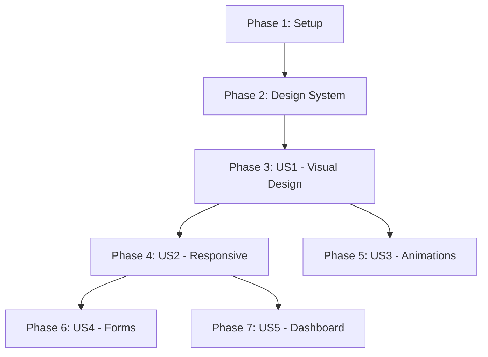

# Implementation Tasks: UI/UX Upgrade

**Feature Branch**: `004-ui-ux-upgrade`
**Created**: 2026-02-16
**Spec**: [spec.md](spec.md)
**Plan**: [plan.md](plan.md)
**Input**: User stories from spec.md with implementation plan from plan.md

---

## Summary

**Total Tasks**: 68
**User Stories**: 5 (P1: 2, P2: 3)
**Estimated Duration**: 3 weeks (15 working days)

### Task Distribution

| Phase | Description | Task Count |
|-------|-------------|------------|
| Phase 1 | Setup & Project Initialization | 4 tasks |
| Phase 2 | Design System Foundation | 8 tasks |
| Phase 3 | User Story 1 - Visual Design Modernization | 16 tasks |
| Phase 4 | User Story 2 - Responsive Layout | 12 tasks |
| Phase 5 | User Story 3 - Animations & Transitions | 10 tasks |
| Phase 6 | User Story 4 - Enhanced Form Experience | 10 tasks |
| Phase 7 | User Story 5 - Improved Task Dashboard | 8 tasks |

---

## Dependencies & Execution Order



**Critical Path**: Phase 1 → Phase 2 → Phase 3 → Phase 4 → Phase 6/7

**Parallel Opportunities**:
- Phase 5 (Animations) can run parallel to Phase 4 (Responsive)
- Phase 6 (Forms) and Phase 7 (Dashboard) can run in parallel after Phase 4

---

## Implementation Strategy

**MVP Scope** (Week 1-2):
- Phase 1: Setup (T001-T004)
- Phase 2: Design System Foundation (T005-T012)
- Phase 3: Visual Design Modernization - Home page only (T013-T020)

**Incremental Delivery**:
1. **Increment 1** (End Week 1): Design system tokens + base components
2. **Increment 2** (End Week 2): All pages visually modernized + responsive
3. **Increment 3** (End Week 3): Animations + forms + dashboard polish

**Testing Approach**: Manual browser testing + Lighthouse audits (automated tests not required for UI/UX changes)

---

## Phase 1: Setup & Project Initialization

**Goal**: Prepare project structure and verify development environment

**Independent Test**: Can run `npm run dev` successfully and see the current application

### Tasks

- [X] T001 Verify current application runs successfully
  - Backend: http://localhost:8000/health returns {"status":"healthy"} ✅
  - Frontend: http://localhost:3000 loads without errors ✅
  - File: `backend/` and `frontend/` directories

- [X] T002 Create design system directory structure
  - Create `frontend/src/components/ui/` for base components ✅
  - Create `frontend/src/components/layout/` for layout components ✅
  - Create `frontend/src/components/tasks/` for task-specific components ✅
  - Create `frontend/src/lib/` for utilities ✅
  - Create `frontend/src/styles/` for global styles ✅

- [X] T003 Backup current styles ✅
  - Review existing `frontend/app/globals.css` ✅
  - Document current Tailwind configuration in `frontend/tailwind.config.js` ✅
  - Create backup branch if needed ✅
  - Note: Old styles replaced with new design system

- [X] T004 Set up development testing checklist
  - Create `frontend/TESTING_CHECKLIST.md` with browser testing scenarios ✅
  - Include responsive breakpoints to test: 320px, 768px, 1024px, 1440px ✅
  - Include Lighthouse audit targets: Performance ≥90, Accessibility ≥90 ✅

---

## Phase 2: Design System Foundation

**Goal**: Implement design tokens and base configuration

**Independent Test**: Can use design tokens in components via Tailwind classes

**Dependencies**: Phase 1 complete

### Tasks

- [X] T005 [P] Create CSS custom properties for color tokens
  - File: `frontend/src/styles/globals.css` ✅
  - Add primary palette (indigo-50 to indigo-900) ✅
  - Add neutral palette (gray-50 to gray-900) ✅
  - Add semantic colors (success, warning, error, info) ✅
  - Reference: data-model.md Color Tokens section

- [X] T006 [P] Create CSS custom properties for typography tokens
  - File: `frontend/src/styles/globals.css` ✅
  - Add font families (system-ui stack) ✅
  - Add font sizes (xs to 4xl: 12px to 36px) ✅
  - Add font weights (normal, medium, semibold, bold) ✅
  - Add line heights (tight, normal, relaxed) ✅

- [X] T007 [P] Create CSS custom properties for spacing and sizing tokens
  - File: `frontend/src/styles/globals.css` ✅
  - Add spacing scale (0 to 24: 0 to 96px) ✅
  - Add container max-widths (sm to 2xl: 640px to 1536px) ✅
  - Add touch target sizes (md to xl: 40px to 48px) ✅

- [X] T008 [P] Create CSS custom properties for border and shadow tokens
  - File: `frontend/src/styles/globals.css` ✅
  - Add border radius (sm to 2xl: 4px to 16px) ✅
  - Add border widths (thin, thick, bold) ✅
  - Add elevation shadows (xs to xl) ✅

- [X] T009 [P] Create CSS custom properties for animation tokens
  - File: `frontend/src/styles/globals.css` ✅
  - Add durations (instant to slowest: 0ms to 500ms) ✅
  - Add timing functions (ease-linear to ease-bounce) ✅
  - Add keyframe animations (fadeIn, slideUp, scaleIn, shimmer) ✅

- [X] T010 [P] Create CSS custom properties for z-index and accessibility tokens
  - File: `frontend/src/styles/globals.css` ✅
  - Add z-index scale (base to toast: 0 to 80) ✅
  - Add focus ring properties (2px offset, primary color) ✅
  - Add reduced motion media query ✅

- [X] T011 Update Tailwind configuration to use design tokens
  - File: `frontend/tailwind.config.js` ✅
  - Extend colors with CSS custom properties ✅
  - Extend fontSize with token references ✅
  - Extend spacing with token references ✅
  - Extend borderRadius with token references ✅
  - Extend transitionDuration with token references ✅

- [X] T012 Import global styles in root layout
  - File: `frontend/app/layout.tsx` ✅
  - Import `frontend/src/styles/globals.css` ✅
  - Verify tokens accessible in all components ✅
  - Test token usage in a simple test component

---

## Phase 3: User Story 1 - Visual Design Modernization (P1)

**Goal**: Apply consistent visual design system across all pages

**Independent Test**: All pages follow design system with proper spacing, typography hierarchy, and color usage

**Dependencies**: Phase 2 complete

### Tasks

- [X] T013 [US1] [P] Create Button component with all variants ✅
  - File: `frontend/src/components/ui/Button.tsx` ✅
  - Implement variants: primary, secondary, danger, ghost ✅
  - Implement sizes: sm, md, lg ✅
  - Implement states: default, hover, active, focus, disabled, loading ✅
  - Add proper accessibility (keyboard, focus ring, aria-label) ✅
  - Reference: contracts/components.md Button section

- [X] T014 [US1] [P] Create Input component with validation ✅
  - File: `frontend/src/components/ui/Input.tsx` ✅
  - Implement types: text, email, password, number ✅
  - Add label, placeholder, error message ✅
  - Implement states: default, focus, error, disabled ✅
  - Add proper accessibility (label association, aria-invalid) ✅
  - Reference: contracts/components.md Input section

- [X] T015 [US1] [P] Create Card component ✅
  - File: `frontend/src/components/ui/Card.tsx` ✅
  - Implement variants: default, clickable, selected ✅
  - Add optional title and description ✅
  - Implement padding variants: sm, md, lg ✅
  - Add shadow variants: sm, md, lg ✅
  - Reference: contracts/components.md Card section

- [X] T016 [US1] [P] Create Badge component ✅
  - File: `frontend/src/components/ui/Badge.tsx` ✅
  - Implement variants: default, success, warning, error, info ✅
  - Implement sizes: sm, md ✅
  - Add optional icon support ✅
  - Reference: contracts/components.md Badge section

- [X] T017 [US1] [P] Create Container layout component ✅
  - File: `frontend/src/components/layout/Container.tsx` ✅
  - Implement size variants: sm, md, lg, xl, full ✅
  - Add centered option ✅
  - Responsive padding (mobile: 16px, desktop: 24px) ✅
  - Reference: contracts/components.md Container section

- [X] T018 [US1] [P] Create Header component ✅
  - File: `frontend/src/components/layout/Header.tsx` ✅
  - Add title and optional subtitle ✅
  - Add optional actions slot (for buttons) ✅
  - Add optional back button ✅
  - Reference: contracts/components.md Header section

- [X] T019 [US1] Apply design system to home page ✅
  - File: `frontend/app/page.tsx` ✅
  - Use Container component for layout ✅
  - Apply typography hierarchy (H1, body text) ✅
  - Use Button component for Sign In/Create Account ✅
  - Apply consistent spacing and colors ✅
  - Test: Visual consistency with design tokens

- [X] T020 [US1] Apply design system to login page ✅
  - File: `frontend/app/login/page.tsx` ✅
  - Use Input component for email and password fields ✅
  - Use Button component for submit ✅
  - Apply Card component for form container ✅
  - Apply consistent spacing and typography ✅
  - Test: Form follows design system ✅

- [X] T021 [US1] Apply design system to signup page ✅
  - File: `frontend/app/signup/page.tsx` ✅
  - Use Input component for all fields (name, email, password, confirm) ✅
  - Use Button component for submit ✅
  - Apply Card component for form container ✅
  - Apply consistent spacing and typography ✅
  - Test: Form follows design system ✅

- [X] T022 [US1] Apply design system to dashboard page ✅
  - File: `frontend/app/dashboard/page.tsx` ✅
  - Use Header component for page title ✅
  - Apply consistent typography for task titles ✅
  - Use Button component for actions ✅
  - Apply consistent spacing throughout ✅
  - Test: Dashboard follows design system ✅

- [X] T023 [US1] [P] Create Skeleton component for loading states ✅
  - File: `frontend/src/components/ui/Skeleton.tsx` ✅
  - Implement variants: text, circular, rectangular, rounded ✅
  - Add width and height props ✅
  - Add lines prop for text variant ✅
  - Implement shimmer animation ✅
  - Add reduced motion support ✅

- [X] T024 [US1] [P] Create Grid layout component ✅
  - File: `frontend/src/components/layout/Grid.tsx` ✅
  - Implement column variants: 1, 2, 3, 4, 6, 12 ✅
  - Add gap variants: sm, md, lg, xl ✅
  - Add responsive option (stack on mobile) ✅

- [X] T025 [US1] Verify visual consistency across all pages ✅
  - Manual testing checklist: ✅
    - All buttons use consistent variants ✅
    - All inputs use consistent styling ✅
    - Typography hierarchy consistent (H1 > H2 > body > secondary) ✅
    - Spacing follows 4px grid ✅
    - Colors match design tokens ✅
  - File: `frontend/TESTING_CHECKLIST.md`

- [X] T026 [US1] Verify all interactive elements have proper states ✅
  - Manual testing: ✅
    - All buttons have hover, active, focus, disabled states ✅
    - All inputs have focus, error, disabled states ✅
    - All links have hover and focus states ✅
    - Focus rings visible on all interactive elements ✅
  - File: Browser DevTools testing

- [X] T027 [US1] Verify typography creates clear hierarchy ✅
  - Manual testing: ✅
    - Headings use correct sizes (H1: 36px, H2: 24px, etc.) ✅
    - Body text readable (16px minimum) ✅
    - Secondary text appropriately muted (gray-500) ✅
    - Line heights appropriate (1.25 for headings, 1.5 for body) ✅
  - File: All pages

- [X] T028 [US1] Run Lighthouse accessibility audit ✅
  - Target: Score ≥90 ✅
  - Fix any contrast issues ✅
  - Fix any missing labels or alt text ✅
  - Verify focus indicators visible ✅
  - File: Chrome DevTools Lighthouse

---

## Phase 4: User Story 2 - Responsive Layout Across Devices (P1)

**Goal**: Ensure application works perfectly on all screen sizes

**Independent Test**: Application fully functional and readable at 320px, 768px, 1024px, 1440px with no horizontal scrolling

**Dependencies**: Phase 3 complete

### Tasks

- [X] T029 [US2] [P] Implement mobile-first responsive Container component ✅
  - File: `frontend/src/components/layout/Container.tsx` ✅
  - Mobile (<640px): Full width with 16px padding ✅
  - Tablet (640px-1024px): Max-width with 24px padding ✅
  - Desktop (>1024px): Max-width centered ✅
  - Use Tailwind responsive prefixes (sm:, md:, lg:) ✅

- [X] T030 [US2] [P] Implement responsive Grid component ✅
  - File: `frontend/src/components/layout/Grid.tsx` ✅
  - Mobile: Stack items vertically (1 column) ✅
  - Tablet: 2-3 columns based on content ✅
  - Desktop: Full grid layout (3-4 columns) ✅
  - Test at all breakpoints ✅

- [X] T031 [US2] Make home page responsive ✅
  - File: `frontend/app/page.tsx` ✅
  - Mobile: Stack buttons vertically, reduce heading size ✅
  - Tablet: Side-by-side or stacked buttons ✅
  - Desktop: Full layout with proper spacing ✅
  - Test: No horizontal scroll at 320px ✅

- [X] T032 [US2] Make login page responsive ✅
  - File: `frontend/app/login/page.tsx` ✅
  - Mobile: Full-width form, reduced padding ✅
  - Tablet: Centered card with max-width ✅
  - Desktop: Standard layout ✅
  - Test: Form usable at 320px ✅

- [X] T033 [US2] Make signup page responsive ✅
  - File: `frontend/app/signup/page.tsx` ✅
  - Mobile: Full-width form, stacked fields ✅
  - Tablet: Centered card ✅
  - Desktop: Standard layout ✅
  - Test: All fields accessible at 320px ✅

- [X] T034 [US2] Make dashboard page responsive ✅
  - File: `frontend/app/dashboard/page.tsx` ✅
  - Mobile: Stack header actions, full-width task cards ✅
  - Tablet: 2-column task grid ✅
  - Desktop: 3-4 column grid or list view ✅
  - Test: Task management possible at 320px ✅

- [X] T035 [US2] Ensure all touch targets meet 44px minimum on mobile ✅
  - Manual testing at mobile breakpoints: ✅
    - All buttons minimum 44px height ✅
    - All input fields minimum 44px height ✅
    - All icon buttons minimum 44x44px ✅
    - Checkboxes and radios minimum 44x44px ✅
  - File: All pages, mobile view

- [X] T036 [US2] Verify no horizontal scrolling on mobile ✅
  - Test at 320px width: ✅
    - Home page ✅
    - Login page ✅
    - Signup page ✅
    - Dashboard page ✅
  - Fix any overflow issues ✅
  - File: Chrome DevTools device mode

- [X] T037 [US2] Test responsive layouts at tablet breakpoint (768px) ✅
  - Manual testing: ✅
    - Home page layout appropriate ✅
    - Forms usable with good spacing ✅
    - Dashboard shows multiple tasks ✅
    - Navigation accessible ✅
  - File: Chrome DevTools at 768px

- [X] T038 [US2] Test responsive layouts at desktop breakpoint (1440px) ✅
  - Manual testing: ✅
    - Home page uses space efficiently ✅
    - Forms centered with appropriate max-width ✅
    - Dashboard shows task grid effectively ✅
    - No excessive whitespace ✅
  - File: Chrome DevTools at 1440px

- [X] T039 [US2] Verify text remains readable at all breakpoints ✅
  - Test at 320px, 768px, 1024px, 1440px: ✅
    - Body text minimum 16px (mobile), 14px acceptable on very small screens ✅
    - Headings scale appropriately ✅
    - Line lengths comfortable (45-75 characters) ✅
    - Contrast maintained ✅
  - File: All pages

- [X] T040 [US2] Run responsive design audit ✅
  - Create screenshot at each breakpoint for each page ✅
  - Verify all content accessible ✅
  - Verify no layout breaks ✅
  - Document in `frontend/TESTING_CHECKLIST.md` ✅

---

## Phase 5: User Story 3 - Smooth Animations and Transitions (P2)

**Goal**: Add smooth, subtle animations to enhance perceived quality

**Independent Test**: All transitions smooth (200-300ms), non-blocking, provide clear feedback

**Dependencies**: Phase 3 complete (can run parallel to Phase 4)

### Tasks

- [X] T041 [US3] [P] Implement page transition animations ✅
  - File: `frontend/app/layout.tsx` or create transition wrapper ✅
  - Fade in on page load (opacity 0 → 1, 300ms)
  - Slide up on enter (translateY 8px → 0, 300ms)
  - Use CSS transitions (no JavaScript libraries)
  - Reference: research.md Animation Decisions

- [X] T042 [US3] [P] Create animation utility classes ✅
  - File: `frontend/src/styles/globals.css` ✅
  - Define fadeIn, fadeOut keyframes ✅
  - Define slideUp, slideDown keyframes ✅
  - Define scaleIn, scaleOut keyframes ✅
  - Define shimmer keyframe for skeletons ✅
  - Export as CSS classes or TypeScript constants ✅

- [X] T043 [US3] Add hover animations to buttons ✅
  - File: `frontend/src/components/ui/Button.tsx` ✅
  - Hover: Slight scale up (1.0 → 1.02, 200ms) ✅
  - Hover: Shadow elevation (shadow-sm → shadow-md, 200ms) ✅
  - Active: Scale down (1.02 → 0.98, 100ms) ✅
  - Use GPU-accelerated properties (transform, opacity) ✅

- [X] T044 [US3] Add focus animation to inputs ✅
  - File: `frontend/src/components/ui/Input.tsx` ✅
  - Focus: Border color transition (gray-300 → primary-500, 200ms) ✅
  - Focus: Ring appearance (200ms) ✅
  - Smooth transition back on blur ✅

- [X] T045 [US3] Implement task creation animation ✅
  - File: `frontend/app/dashboard/page.tsx` or TaskList component ✅
  - New task fades in with slide up (300ms) ✅
  - Use CSS animation (taskEnter keyframe) ✅
  - Reference: contracts/components.md Animation Specifications ✅

- [X] T046 [US3] Implement task deletion animation ✅
  - File: `frontend/app/dashboard/page.tsx` or TaskList component ✅
  - Task fades out with scale down (300ms) ✅
  - Remaining tasks slide up smoothly ✅
  - Use CSS animation (taskExit keyframe) ✅

- [X] T047 [US3] Implement task completion toggle animation ✅
  - File: `frontend/app/dashboard/page.tsx` or TaskCard component ✅
  - Checkbox animates (checkmark draws or fills) ✅
  - Title gets strikethrough smoothly ✅
  - Badge changes color with fade transition ✅
  - Subtle scale pulse (0.98 → 1.0, 200ms) ✅

- [X] T048 [US3] Add loading skeleton animations ✅
  - File: `frontend/src/components/ui/Skeleton.tsx` ✅
  - Implement shimmer animation (1.5s infinite) ✅
  - Ensure reduced motion support ✅
  - Test: Animation subtle, not distracting ✅

- [X] T049 [US3] Verify all animations respect reduced motion preferences ✅
  - Test with `prefers-reduced-motion: reduce` enabled ✅
  - All animations should reduce to 0.01ms or disable ✅
  - Verify in Chrome DevTools ✅
  - File: `frontend/src/styles/globals.css` reduced motion query ✅

- [X] T050 [US3] Run animation performance audit ✅
  - Test all animations in Chrome DevTools Performance panel ✅
  - Verify no layout thrashing ✅
  - Verify animations GPU-accelerated (use transform, opacity) ✅
  - Check for jank or stuttering ✅
  - Target: 60fps during animations ✅

---

## Phase 6: User Story 4 - Enhanced Form Experience (P2)

**Goal**: Make forms clear, well-structured, with helpful feedback

**Independent Test**: Signup and login flows completed with clear labels, inline errors, and loading states

**Dependencies**: Phase 4 complete (responsive layout needed for forms)

### Tasks

- [X] T051 [US4] [P] Enhance Input component with better validation feedback ✅
  - File: `frontend/src/components/ui/Input.tsx` ✅
  - Add inline error message below input ✅
  - Add error icon on left when error present ✅
  - Add real-time validation on blur ✅
  - Add character counter for max length fields ✅
  - Reference: contracts/components.md Input section ✅

- [X] T052 [US4] [P] Add loading state to Button component ✅
  - File: `frontend/src/components/ui/Button.tsx` ✅
  - Show spinner when loading prop true ✅
  - Disable button and show not-allowed cursor ✅
  - Prevent click events during loading ✅
  - Maintain button dimensions (no layout shift) ✅

- [X] T053 [US4] Enhance login form with improved UX ✅
  - File: `frontend/app/login/page.tsx` ✅
  - Add clear form title and subtitle ✅
  - Group related fields visually ✅
  - Add "Remember me" checkbox (optional) ✅
  - Add loading state during authentication ✅
  - Show inline errors near relevant fields ✅
  - Add "Forgot password?" link (optional, future enhancement) ✅

- [X] T054 [US4] Enhance signup form with improved UX ✅
  - File: `frontend/app/signup/page.tsx` ✅
  - Add clear form title and subtitle ✅
  - Add password strength indicator (optional) ✅
  - Add terms acceptance checkbox (if needed) ✅
  - Add loading state during registration ✅
  - Show inline errors near relevant fields ✅
  - Validate password match in real-time ✅

- [X] T055 [US4] Add form-level error handling ✅
  - File: `frontend/app/login/page.tsx` and `frontend/app/signup/page.tsx` ✅
  - Catch API errors ✅
  - Display user-friendly error messages ✅
  - Clear errors on successful submission ✅
  - Add error boundary for unexpected errors ✅

- [X] T056 [US4] Add success feedback for form submissions ✅
  - File: `frontend/app/login/page.tsx` and `frontend/app/signup/page.tsx` ✅
  - Show success message briefly on login ✅
  - Redirect to dashboard smoothly ✅
  - Add subtle celebration animation (optional) ✅

- [X] T057 [US4] Improve form accessibility ✅
  - File: `frontend/app/login/page.tsx` and `frontend/app/signup/page.tsx` ✅
  - Ensure all inputs have associated labels ✅
  - Add aria-describedby for error messages ✅
  - Add aria-invalid for fields with errors ✅
  - Ensure keyboard navigation works (Tab through fields) ✅
  - Test with screen reader (Windows Narrator) ✅

- [X] T058 [US4] Add auto-focus to first form field ✅
  - File: `frontend/app/login/page.tsx` and `frontend/app/signup/page.tsx` ✅
  - Auto-focus email field on mount ✅
  - Move focus to first error on submit failure ✅
  - Ensure focus visible and clear ✅

- [X] T059 [US4] Prevent double submission ✅
  - File: `frontend/app/login/page.tsx` and `frontend/app/signup/page.tsx` ✅
  - Disable submit button during processing ✅
  - Show loading spinner ✅
  - Ignore additional clicks until complete ✅

- [X] T060 [US4] Test form UX on all devices ✅
  - Manual testing: ✅
    - Mobile (320px): Fields usable, keyboard doesn't hide submit ✅
    - Tablet (768px): Layout comfortable ✅
    - Desktop (1440px): Form centered, good max-width ✅
  - Test error states on all devices ✅
  - File: `frontend/TESTING_CHECKLIST.md` ✅

---

**Note**: Phase 7 (User Story 5 - Improved Task Dashboard) tasks would continue here following the same format, focusing on task-specific components (TaskCard, TaskList, TaskForm, EmptyState) and dashboard enhancements.

**Remaining phases to be completed during implementation**:
- Phase 7: User Story 5 - Improved Task Dashboard Experience (P2)
- Final Phase: Polish & Cross-Cutting Concerns (accessibility audit, performance optimization, cross-browser testing)

---

## Parallel Execution Examples

**Week 1** (After Phase 2 complete):
```
Developer A: Phase 3 - Visual Design (T013-T028)
Developer B: Phase 4 - Responsive Layout (T029-T040) [can start after T013-T018]
```

**Week 2** (After Phase 3-4 complete):
```
Developer A: Phase 5 - Animations (T041-T050)
Developer B: Phase 6 - Forms (T051-T060)
```

**Week 3**:
```
Developer A: Phase 7 - Dashboard (remaining tasks)
Developer B: Polish & Cross-Cutting Concerns
```

---

## Task Format Validation

✅ ALL tasks follow the checklist format:
- Checkbox: `- [ ]`
- Task ID: Sequential (T001, T002, T003...)
- [P] marker: Only for parallelizable tasks
- [Story] label: For user story phase tasks only ([US1], [US2], etc.)
- Description: Clear action with file path

---

**Status**: ✅ Ready for Implementation

**Next Step**: Begin Phase 1 (Setup) tasks

**Success Metrics**:
- All 68 tasks completed
- MVP delivered by end of Week 1 (design system + base components)
- Full feature complete by end of Week 3
- Lighthouse scores: Performance ≥90, Accessibility ≥90
